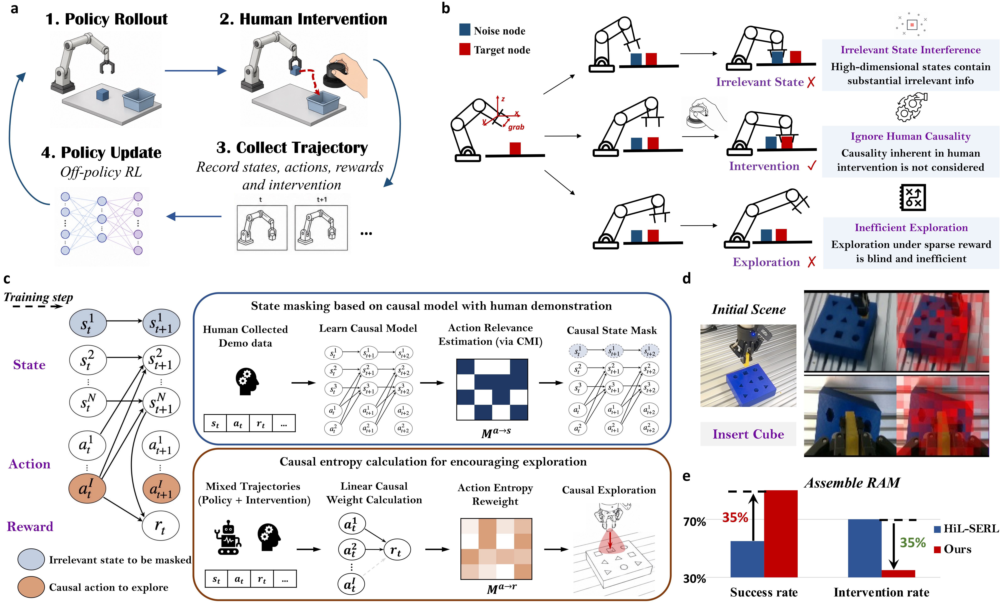

# 🚀 CIRL: Towards Efficient Real-World Human-in-the-Loop Reinforcement Learning with Causal Influence

<div align="center">

[](https://www.python.org/)
[](https://github.com/google/jax)
[](LICENSE)
[](#overview-and-code-structure)

</div>

---

<p align="center">
  
</p>

**CIRL (Causal-Influence Reinforcement Learning)** is a highly sample-efficient framework designed to train robotic manipulation policies. By leveraging **Causal Masking Interventions** in the latent state space combined with **Human-in-the-Loop corrections/demonstrations**, CIRL achieves near-perfect success rates on complex real-world tasks in a fraction of the time compared to standard reinforcement learning methods.

---

## 📌 Table of Contents
- [✨ Key Features](#-key-features)
- [⚙️ Installation](#%EF%B8%8F-installation)
- [📐 Overview & System Architecture](#-overview--system-architecture)
- [📂 Codebase Structure](#-codebase-structure)
- [🍌 Tutorial: Running the Pick & Place Task](#-tutorial-running-the-pick--place-task)
- [🛠️ Creating a New Task](#%EF%B8%8F-creating-a-new-task)

---

## ✨ Key Features

* **🧠 Causal Influence Masking**: Automatically detects weakly action-dependent dimensions in the policy's visual latent space and masks them to eliminate causal confusion.
* **⚡ Asynchronous Actor-Learner Parallelism**: Multi-node architecture where the policy network actor collects transitions and syncs weights, while the GPU learner updates parameters in parallel.
* **🤝 Human-in-the-Loop Intervention**: Wrappers supporting SpaceMouse intervention, seamlessly blending expert corrections into the replay buffer to accelerate learning.
* **💎 Fully Integrated UR Env**: Complete out-of-the-box infrastructure featuring RealSense camera stack, interactive cropping tool, and robot controller servers.

---

## ⚙️ Installation

### 1. Set Up Conda Environment
Create a clean Conda environment with Python 3.10:
```bash
conda create -n cirl python=3.10 -y
conda activate cirl
```

### 2. Install JAX
Depending on your platform, select the appropriate installer:

* **GPU (Recommended)**:
  ```bash
  pip install --upgrade "jax[cuda12_pip]==0.4.35" -f https://storage.googleapis.com/jax-releases/jax_cuda_releases.html
  ```
* **CPU only**:
  ```bash
  pip install --upgrade "jax[cpu]"
  ```
* **TPU**:
  ```bash
  pip install --upgrade "jax[tpu]" -f https://storage.googleapis.com/jax-releases/libtpu_releases.html
  ```

### 3. Install CIRL Packages
Install the policy launcher package and the robot hardware interface:
```bash
# 1. Install CIRL Launcher (Training agent)
cd serl_launcher
pip install -e .
pip install -r requirements.txt
cd ..

# 2. Install CIRL Robot Infra (Env, Controllers & Cameras)
cd serl_robot_infra
pip install -e .
cd ..
```

---

## 📐 Overview & System Architecture

The core of CIRL uses an asynchronous design. This allows parallel execution of inference and policy optimization:

```
                  ┌─────────────────────────────────────┐
                  │          Human Operator             │
                  └──────────────────┬──────────────────┘
                                     │ (SpaceMouse Intervention)
                                     ▼
  ┌─────────────────────────────────────────────────────────────────────┐
  │                              Actor Node                             │
  │   - Gym Environment (Robot Controllers + Cameras)                  │
  │   - Action Selection via Local Policy Model                         │
  └──────┬──────────────────────────────────────────────────────▲───────┘
         │                                                      │
         │ (Send Transitions)                                   │ (Sync Weights)
         ▼                                                      │
  ┌─────────────────────────────────────────────────────────────┴───────┐
  │                             Learner Node                            │
  │   - Replay Buffer (Demos + Online Corrections)                      │
  │   - Causal Model (P(z_next | z, action)) Training                   │
  │   - GPU Policy Optimization (JAX RLPD Agent)                        │
  └─────────────────────────────────────────────────────────────────────┘
```

---

## 📂 Codebase Structure

```yaml
CIRL/
├── serl_launcher/             # RL policy models, agents (SAC/RLPD), and network definitions
│   ├── serl_launcher/agents/  # Continuous policy architectures (with hybrid grippers)
│   ├── serl_launcher/common/  # Latent encoders (ResNet) and custom JAX training wrappers
│   └── serl_launcher/utils/   # Causal model state checkpointer & causal masking utilities
├── serl_robot_infra/          # Low-level hardware drivers and Gym environments
│   ├── robot_servers/         # Flask servers interfacing with low-level robot controllers
│   ├── ur_env/                # Universal Robot (UR) Gym environments and camera tools
└── examples/                  # Task configurations, scripts, and launch scripts
    ├── experiments/           # Specific task configs (e.g. pick_place_banana)
    └── record_demos.py        # Spacemouse demonstration collection script
```

---

## 🍌 Tutorial: Running the Pick & Place Task

Follow these step-by-step instructions to train the **Pick & Place Banana** task on the UR robot.

### Step 1: Verify Hardware & SpaceMouse Control
Verify connection and test raw SpaceMouse readings:
```bash
conda activate cirl
python examples/test_reset_spacemouse.py \
    --exp_name pick_place_banana \
    --steps 200 \
    --print_pose_every 5
```

### Step 2: Interactive Camera Crop Region Configuration
Configure camera bounds using the GUI helper:
```bash
export UR_ROBOT_IP=192.168.56.101
export HAND_SERIAL=218622271809
export EXTERNAL_SERIAL=254622076156

python serl_robot_infra/ur_env/camera/interactive_crop.py \
    --experiment pick_place_banana \
    --output /tmp/ur7e_camera_crops.json
```

### Step 3: Record Human Demonstrations
Collect successful human expert demonstrations (we recommend $\ge$ 10 successes):
```bash
cd examples/experiments/pick_place_banana

export UR_ROBOT_IP=192.168.56.101
export HAND_SERIAL=218622271809
export EXTERNAL_SERIAL=254622076156

python ../../record_demos.py \
    --exp_name pick_place_banana \
    --successes_needed 10
```

### Step 4: Policy Training (New Run)
Start a new policy training run. Learner and actor panes will launch automatically in a split TMUX layout:
```bash
cd examples/experiments/pick_place_banana

export NEW_RUN=1
export RUN_ID=banana_$(date +%Y%m%d_%H%M%S)
export DEMO_PATH=./demo_data/pick_place_banana_demos.pkl  # Set path to recorded demo pickle

export WANDB_API_KEY=your_wandb_api_key
export UR_ROBOT_IP=192.168.56.101
export HAND_SERIAL=218622271809
export EXTERNAL_SERIAL=254622076156

./run_tmux.sh
```

### Step 5: Resume Training
If you need to resume training from a prior checkpoint:
```bash
cd examples/experiments/pick_place_banana

unset NEW_RUN
unset CHECKPOINT_PATH

export RUN_ID=banana_20260516_114232  # Specify target run folder name
export RESUME_TRAINING=1
export DEMO_PATH=./demo_data/pick_place_banana_demos.pkl

export WANDB_API_KEY=your_wandb_api_key
export UR_ROBOT_IP=192.168.56.101
export HAND_SERIAL=218622271809
export EXTERNAL_SERIAL=254622076156

./run_tmux.sh
```

### Step 6: Evaluation & Inference
Test the trained policy on the physical robot:
```bash
cd examples/experiments/pick_place_banana

export RUN_ID=banana_your_run_id
export EVAL_CHECKPOINT_STEP=10000
export EVAL_N_TRAJS=10

export UR_ROBOT_IP=192.168.56.101
export HAND_SERIAL=218622271809
export EXTERNAL_SERIAL=254622076156

./run_eval.sh
```

---

## 🛠️ Creating a New Task

To create a new task using CIRL:

1. **Create a Task Folder**: Put a new directory under `examples/experiments/` (e.g. `my_new_task`).
2. **Implement Task Files**: Add the following standard files:
   * `config.py`: Inherits `DefaultTrainingConfig` and `DefaultEnvConfig` (stiffness, limits, RealSense serials).
   * `wrapper.py`: Defines task reward penalties, action boundaries, and target positions.
   * `run_actor.sh` & `run_learner.sh`: Launcher shell scripts mapping to the task folder.
3. **Register Config Mapping**: Add your task config reference to [mappings.py](file:///Users/hongyecao/Desktop/PyCharm/RealWorld_RL/UR/github_code/examples/experiments/mappings.py).
4. **Register Robot Environment (If New Robot)**: Create a new environment interface and controller under `serl_robot_infra` mirroring `ur_env`.
